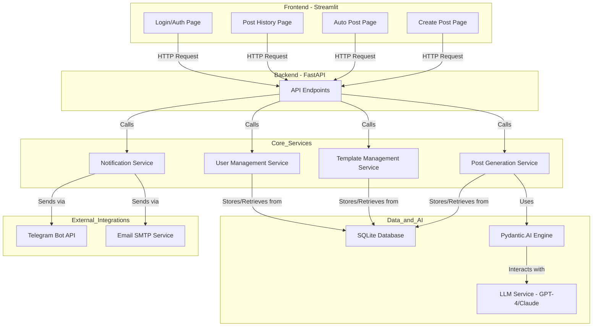

# Comprehensive Architecture Blueprint: AI Powered LinkedIn Ghostwriter

This document provides a detailed architectural blueprint for the AI Powered LinkedIn Ghostwriter application. It is designed to serve as a comprehensive guide for development, covering everything from high-level structure to detailed implementation plans.

## 1. High-Level Architecture

The application follows a decoupled frontend-backend architecture, ensuring separation of concerns and scalability.

-   **Frontend**: A Python-based Streamlit application serves as the user interface. It's chosen for its simplicity and rapid development, ideal for a utility-focused web app.
-   **Backend**: A Python-based FastAPI application handles all business logic, AI interactions, and third-party integrations. This provides a robust, scalable, and high-performance API.
-   **Database**: A lightweight SQLite database will be used for initial development to store user preferences, post history, and templates. It can be easily migrated to a more robust solution like PostgreSQL if needed.
-   **AI Engine**: Pydantic.AI will structure prompts and ensure consistent, high-quality output from the chosen LLM (e.g., GPT-4, Claude).
-   **Integrations**: The backend will integrate with the Telegram Bot API and an SMTP service (e.g., SendGrid) for delivering generated posts.

### Mermaid Diagram: System Components



## 2. Project Directory Structure

A monorepo structure will be used to keep the frontend and backend code organized within a single project.

```
.
├── backend/
│   ├── app/
│   │   ├── api/
│   │   │   └── v1/
│   │   │       ├── __init__.py
│   │   │       ├── endpoints/
│   │   │       │   ├── __init__.py
│   │   │       │   ├── posts.py
│   │   │       │   ├── templates.py
│   │   │       │   └── auth.py
│   │   │       └── router.py
│   │   ├── core/
│   │   │   ├── __init__.py
│   │   │   ├── config.py
│   │   │   └── security.py
│   │   ├── db/
│   │   │   ├── __init__.py
│   │   │   ├── models.py
│   │   │   └── session.py
│   │   ├── schemas/
│   │   │   ├── __init__.py
│   │   │   ├── post.py
│   │   │   ├── template.py
│   │   │   └── user.py
│   │   ├── services/
│   │   │   ├── __init__.py
│   │   │   ├── post_generator.py
│   │   │   └── notification_service.py
│   │   ├── __init__.py
│   │   └── main.py
│   ├── tests/
│   │   ├── __init__.py
│   │   ├── test_posts_api.py
│   │   └── test_templates_api.py
│   └── requirements.txt
├── database/
│   └── schema.sql
├── docs/
│   └── architecture.md
├── frontend/
│   ├── assets/
│   ├── components/
│   │   ├── __init__.py
│   │   └── layout.py
│   ├── pages/
│   │   ├── 1_Create_Post.py
│   │   ├── 2_Auto_Post.py
│   │   ├── 3_My_Posts.py
│   │   └── 4_Login.py
│   ├── utils/
│   │   ├── __init__.py
│   │   └── api_client.py
│   ├── app.py
│   └── requirements.txt
├── .env.example
├── .gitignore
└── README.md
```

## 3. Database Schema Outline

The database will consist of three main tables. The following SQL statements outline the schema for SQLite.

**File: `database/schema.sql`**
```sql
-- Users Table: Stores basic user information and preferences.
CREATE TABLE IF NOT EXISTS users (
    id INTEGER PRIMARY KEY AUTOINCREMENT,
    email TEXT UNIQUE NOT NULL,
    hashed_password TEXT NOT NULL,
    telegram_chat_id TEXT,
    created_at TIMESTAMP DEFAULT CURRENT_TIMESTAMP
);

-- Templates Table: Stores predefined post templates for Auto Post Mode.
CREATE TABLE IF NOT EXISTS templates (
    id INTEGER PRIMARY KEY AUTOINCREMENT,
    name TEXT NOT NULL,
    category TEXT NOT NULL, -- e.g., 'Case Study', 'Build in Public'
    structure TEXT NOT NULL, -- e.g., 'Hook -> Story -> Lesson -> CTA'
    prompt TEXT NOT NULL, -- The base prompt for the LLM
    created_at TIMESTAMP DEFAULT CURRENT_TIMESTAMP
);

-- Posts Table: Stores the history of all generated posts.
CREATE TABLE IF NOT EXISTS posts (
    id INTEGER PRIMARY KEY AUTOINCREMENT,
    user_id INTEGER NOT NULL,
    content TEXT NOT NULL,
    template_id INTEGER, -- Can be NULL if generated in Create Post Mode
    generation_mode TEXT NOT NULL, -- 'manual' or 'auto'
    created_at TIMESTAMP DEFAULT CURRENT_TIMESTAMP,
    FOREIGN KEY (user_id) REFERENCES users (id),
    FOREIGN KEY (template_id) REFERENCES templates (id)
);
```

## 4. API Structure (FastAPI)

The API will be versioned under `/api/v1`. All responses will use standard HTTP status codes.

### Authentication (`/api/v1/auth`)
-   **`POST /token`**: Login endpoint. Takes a username (email) and password, returns a JWT access token.
-   **`POST /register`**: User registration.

### Posts (`/api/v1/posts`)
-   **`POST /`**: Generate a new post. This is the core endpoint.
    -   **Auth**: Required.
    -   **Request Body**: Contains all context for generation (mode, message, references, tone, etc.).
    -   **Response**: The generated post content.
-   **`GET /`**: Get post history for the authenticated user.
    -   **Auth**: Required.
    -   **Response**: A list of previously generated posts.
-   **`POST /{post_id}/send`**: Send a generated post via a notification channel.
    -   **Auth**: Required.
    -   **Request Body**: `{ "channel": "telegram" | "email" }`
    -   **Response**: Success/failure message.

### Templates (`/api/v1/templates`)
-   **`GET /`**: Get all available post templates.
    -   **Auth**: Required.
    -   **Response**: A list of all templates, grouped by category.
-   **`POST /`**: (Admin) Create a new template.
-   **`PUT /{template_id}`**: (Admin) Update an existing template.

## 5. Core Features Scaffolding

This section outlines the implementation approach for the key features.

### Feature 1: Create Post Mode (Manual)
-   **Frontend (`frontend/pages/1_Create_Post.py`)**:
    -   UI will consist of Streamlit widgets: `st.selectbox` for post type, `st.text_area` for the main message, `st.file_uploader` for references, and `st.text_input` for other context.
    -   On "Generate" click, the `api_client.py` will be called to send a request to the `POST /posts` endpoint.
-   **Backend (`backend/services/post_generator.py`)**:
    -   The service will receive the raw inputs from the API endpoint.
    -   It will construct a detailed prompt using the Pydantic.AI schema.
    -   The prompt will be sent to the LLM service.
    -   The generated content will be saved to the `posts` table and returned to the user.

### Feature 2: Auto Post Mode (Template-Driven)
-   **Frontend (`frontend/pages/2_Auto_Post.py`)**:
    -   UI will first call the `GET /templates` endpoint to fetch and display available templates.
    -   User selects a template, then provides a main message and optional references.
    -   On "Generate" click, it will call the `POST /posts` endpoint with the `template_id` and other context.
-   **Backend (`backend/services/post_generator.py`)**:
    -   The service will fetch the template's base prompt from the database.
    -   It will combine the template prompt with the user's inputs to create the final prompt for the LLM.
    -   The rest of the flow is similar to the manual mode.

### Feature 3: Messaging & Notifications
-   **Backend (`backend/services/notification_service.py`)**:
    -   This service will contain two main functions: `send_telegram(chat_id, message)` and `send_email(recipient, subject, body)`.
    -   These functions will be called by the `POST /posts/{post_id}/send` endpoint.
    -   Credentials (bot token, SMTP details) will be loaded securely from environment variables via `core/config.py`.

## 6. Testing Strategy

A multi-layered testing approach will be adopted.

-   **Unit Tests**:
    -   **Location**: `backend/tests/`
    -   **Framework**: `pytest`
    -   **Focus**: Test individual functions and services in isolation (e.g., prompt generation logic, notification service functions). Mock external dependencies like the LLM and database.
-   **Integration Tests**:
    -   **Focus**: Test the interaction between different components, especially the API endpoints and the database. Use a test database to ensure data integrity.
-   **End-to-End (E2E) Tests**:
    -   **Framework**: (Optional, for later stages) A tool like Selenium or Playwright could be used to test the Streamlit UI flow. For the MVP, manual testing is sufficient.

## 7. Security Implementation Plan

-   **Authentication**:
    -   JWT (JSON Web Tokens) will be used for securing API endpoints.
    -   Passwords will be hashed using `passlib` before being stored in the database.
    -   The `backend/core/security.py` file will contain all helper functions for password hashing and JWT creation/verification.
-   **Environment Variables**:
    -   All sensitive information (API keys, database URLs, secret keys) will be managed through a `.env` file and loaded via `pydantic-settings`.
    -   The `.env` file will be listed in `.gitignore` to prevent it from being committed to version control.
-   **API Security**:
    -   FastAPI's built-in dependency injection system will be used to protect routes that require authentication.
    -   Input validation will be handled automatically by Pydantic models to prevent common injection attacks.

## 8. Development Workflow

A simple, effective workflow will be followed.

1.  **Setup**:
    -   Clone the repository.
    -   Create and activate a virtual environment: `python -m venv venv && source venv/bin/activate`.
    -   Install dependencies for both backend and frontend: `pip install -r backend/requirements.txt` and `pip install -r frontend/requirements.txt`.
    -   Create a `.env` file from `.env.example` and fill in the required values.
2.  **Running the Application**:
    -   **Backend**: Navigate to the `backend/` directory and run `uvicorn app.main:app --reload`.
    -   **Frontend**: Navigate to the `frontend/` directory and run `streamlit run app.py`.
3.  **Branching Strategy**:
    -   `main`: Production-ready code.
    -   `develop`: Integration branch for features.
    -   `feature/<feature-name>`: Branches for new features.
4.  **Code Quality**:
    -   **Linter/Formatter**: `ruff` will be used for linting and formatting to ensure consistent code style.
    -   A pre-commit hook can be set up to run the linter before each commit.

This comprehensive blueprint provides a clear path forward for the development of the LinkedIn Ghostwriter application.