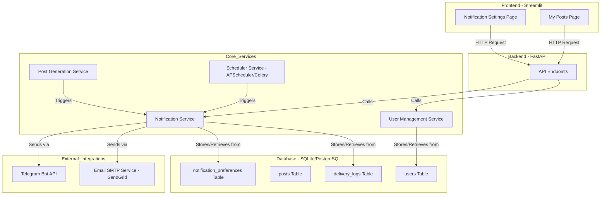
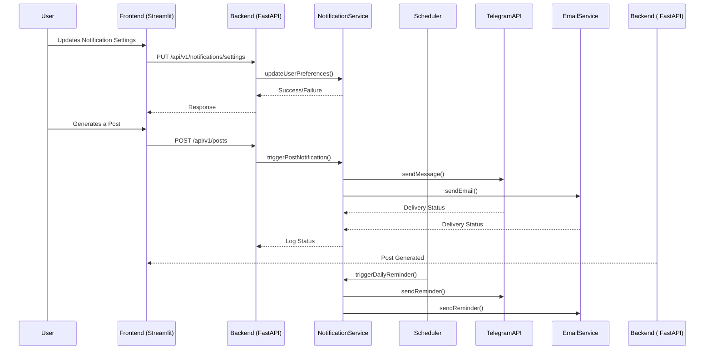
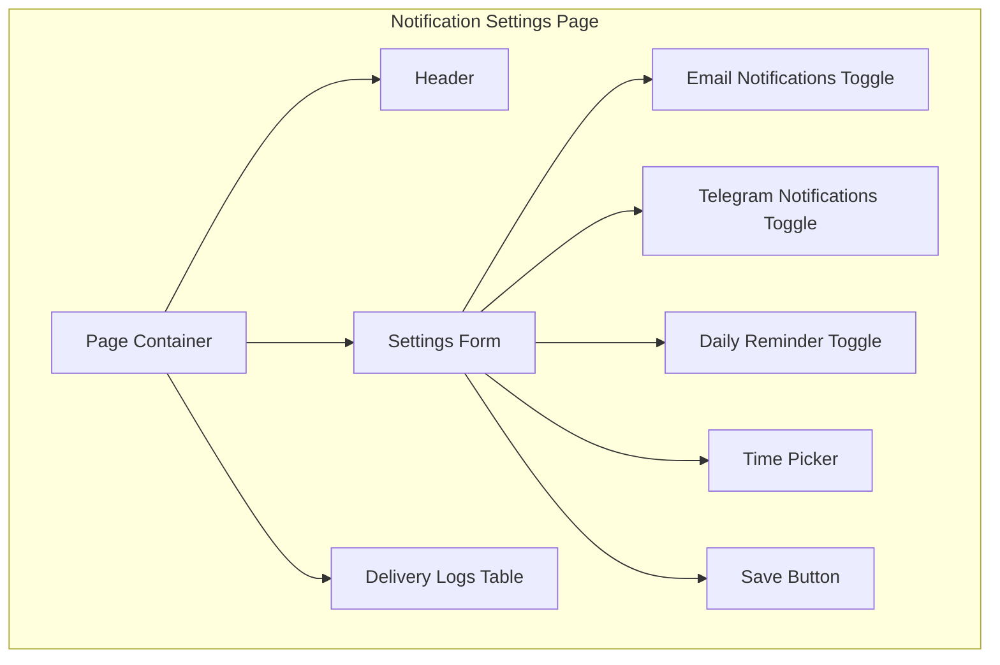
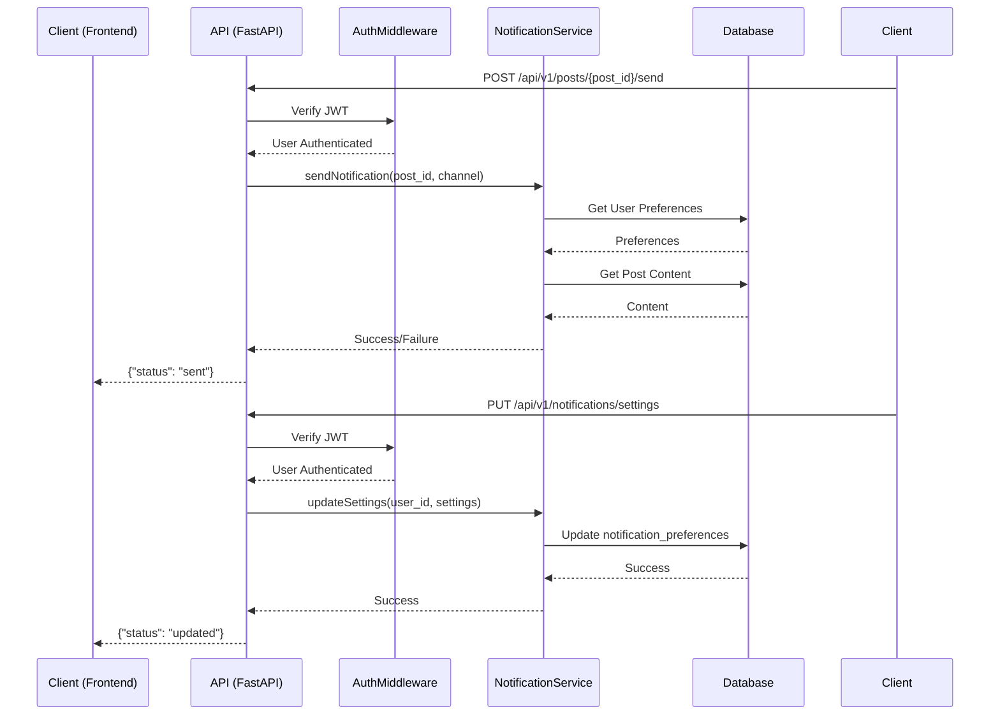

# Comprehensive Feature Architecture: Messaging & Notifications

This document provides a complete architectural blueprint for the Messaging & Notifications feature. It contains all necessary details for implementation by a coding assistant without requiring additional clarification.

## 1. Feature Overview

### Feature Name
Messaging & Notifications

### Feature Description
This feature enables automated delivery of generated LinkedIn posts to users via Telegram and email, along with daily posting reminders and error notifications. It ensures users can instantly access, review, and manage their AI-generated posts across channels they already use. The goal is to streamline workflow and maintain daily content consistency for professionals, founders, and creators without requiring manual copying or downloads.

### User Stories
- As a user, I want to receive my AI-generated LinkedIn post directly on Telegram, so I can review or approve it quickly before publishing.
- As a user, I want to get the generated post in my inbox, formatted and ready to post, so I can manage my drafts through email.
- As a user, I want to receive daily reminders via Telegram or email to post new content, so I can stay consistent in my posting routine.
- As a user, I want to get notified if post delivery fails and retry sending, so I never lose generated content.

### Acceptance Criteria
- Telegram Bot sends generated post to user with inline actions: 👍 Approve | ♻️ Regenerate | 🗑️ Delete.
- Email delivery uses SMTP/SendGrid and sends the formatted post with subject “Your LinkedIn Ghostwriter Post Draft.”
- Optional daily reminders are configurable by time and channel (email/Telegram).
- Delivery failures trigger error messages and retry options in the UI.
- All messages and events are logged for monitoring.

### Dependencies
- **User Management Service**: To retrieve user details like email and Telegram chat ID.
- **Post Generation Service**: To trigger notifications after a post is successfully generated.
- **Database**: To store user notification preferences and delivery logs.

## 2. Architecture Diagrams

### System Architecture Diagram
This diagram illustrates how the Messaging & Notifications feature integrates with the existing application architecture.



### Data Flow Diagram
This diagram illustrates how data moves through the notification system, from user action to final delivery.



### Component Hierarchy Diagram
This diagram shows the structure of the frontend components for the notification settings.



### API Flow Diagram
This diagram details the request/response flow for the core notification-related API endpoints.



## 3. Database Architecture

This section details the required database changes to support the Messaging & Notifications feature.

### Schema Changes
Two new tables are required: `notification_preferences` and `delivery_logs`. The existing `users` table will also be updated.

**File: `database/schema.sql` (Additions)**
```sql
-- Notification Preferences Table: Stores user-specific notification settings.
CREATE TABLE IF NOT EXISTS notification_preferences (
    id INTEGER PRIMARY KEY AUTOINCREMENT,
    user_id INTEGER UNIQUE NOT NULL,
    receive_email_notifications BOOLEAN DEFAULT TRUE,
    receive_telegram_notifications BOOLEAN DEFAULT TRUE,
    daily_reminder_enabled BOOLEAN DEFAULT FALSE,
    daily_reminder_time TIME DEFAULT '09:00:00',
    FOREIGN KEY (user_id) REFERENCES users (id)
);

-- Delivery Logs Table: Logs the status of every notification sent.
CREATE TABLE IF NOT EXISTS delivery_logs (
    id INTEGER PRIMARY KEY AUTOINCREMENT,
    user_id INTEGER NOT NULL,
    post_id INTEGER,
    channel TEXT NOT NULL, -- 'email' or 'telegram'
    status TEXT NOT NULL, -- 'delivered', 'failed', 'retried'
    error_message TEXT,
    created_at TIMESTAMP DEFAULT CURRENT_TIMESTAMP,
    FOREIGN KEY (user_id) REFERENCES users (id),
    FOREIGN KEY (post_id) REFERENCES posts (id)
);

-- Alter Users Table: Add telegram_chat_id if it doesn't exist
-- This is illustrative. A proper migration script should handle this.
ALTER TABLE users ADD COLUMN telegram_chat_id TEXT;
```

### Data Models
These TypeScript interfaces define the shape of the data structures.

```typescript
// backend/app/schemas/notification.py (Illustrative Pydantic Models)

import { BaseModel } from 'pydantic';
import { time } from 'datetime';

export interface NotificationPreferences extends BaseModel {
  id: number;
  user_id: number;
  receive_email_notifications: boolean;
  receive_telegram_notifications: boolean;
  daily_reminder_enabled: boolean;
  daily_reminder_time: time;
}

export interface DeliveryLog extends BaseModel {
  id: number;
  user_id: number;
  post_id?: number;
  channel: 'email' | 'telegram';
  status: 'delivered' | 'failed' | 'retried';
  error_message?: string;
  created_at: Date;
}
```

### Relationships
-   `users` (one) -> `notification_preferences` (one): Each user has one set of notification preferences.
-   `users` (one) -> `delivery_logs` (many): Each user can have many delivery log entries.
-   `posts` (one) -> `delivery_logs` (many): Each post can be associated with multiple delivery attempts.

### Indexes
-   An index should be created on `delivery_logs(user_id)` to quickly retrieve a user's notification history.
-   An index on `notification_preferences(user_id)` is also recommended for fast lookups.

### Migrations
A migration script will be required to:
1.  Add the `telegram_chat_id` column to the `users` table.
2.  Create the `notification_preferences` table.
3.  Create the `delivery_logs` table.
4.  Backfill the `notification_preferences` table with default settings for all existing users.

## 4. API Architecture

This section defines the API endpoints required for the Messaging & Notifications feature. All endpoints are under the `/api/v1` prefix.

### Endpoint Definitions

#### 1. Update Notification Settings
- **Route**: `PUT /notifications/settings`
- **Description**: Updates the notification preferences for the authenticated user.
- **Authentication**: Required (JWT).
- **Request Body**:
  ```typescript
  interface UpdateNotificationSettingsRequest {
    receive_email_notifications?: boolean;
    receive_telegram_notifications?: boolean;
    daily_reminder_enabled?: boolean;
    daily_reminder_time?: string; // Format: "HH:MM:SS"
    telegram_chat_id?: string;
  }
  ```
- **Response (200 OK)**:
  ```typescript
  interface NotificationSettingsResponse {
    id: number;
    user_id: number;
    receive_email_notifications: boolean;
    receive_telegram_notifications: boolean;
    daily_reminder_enabled: boolean;
    daily_reminder_time: string; // Format: "HH:MM:SS"
  }
  ```
- **Error Responses**:
  - `400 Bad Request`: Invalid time format or other validation errors.
  - `401 Unauthorized`: Invalid or missing token.
  - `404 Not Found`: User preferences not found.

#### 2. Get Notification Settings
- **Route**: `GET /notifications/settings`
- **Description**: Retrieves the current notification preferences for the authenticated user.
- **Authentication**: Required (JWT).
- **Response (200 OK)**: Same as `NotificationSettingsResponse` above.
- **Error Responses**:
  - `401 Unauthorized`: Invalid or missing token.
  - `404 Not Found`: User preferences not found.

#### 3. Get Delivery Logs
- **Route**: `GET /notifications/logs`
- **Description**: Retrieves a paginated list of delivery logs for the authenticated user.
- **Authentication**: Required (JWT).
- **Query Parameters**: `?page=1&limit=20`
- **Response (200 OK)**:
  ```typescript
  interface DeliveryLogResponse {
    logs: DeliveryLog[];
    total: number;
    page: number;
    limit: number;
  }
  ```
- **Error Responses**:
  - `401 Unauthorized`: Invalid or missing token.

#### 4. Send Post Notification
- **Route**: `POST /posts/{post_id}/send`
- **Description**: Manually triggers sending a generated post to a specified channel.
- **Authentication**: Required (JWT).
- **Request Body**:
  ```typescript
  interface SendPostRequest {
    channel: 'email' | 'telegram';
  }
  ```
- **Response (202 Accepted)**:
  ```typescript
  {
    "status": "queued",
    "message": "Post delivery has been queued."
  }
  ```
- **Error Responses**:
  - `400 Bad Request`: Invalid channel.
  - `401 Unauthorized`: Invalid or missing token.
  - `404 Not Found`: Post not found.

#### 5. Telegram Callback Handler
- **Route**: `POST /telegram/callback`
- **Description**: Handles callbacks from Telegram inline buttons (Approve, Regenerate, Delete).
- **Authentication**: None (Webhook will be secured with a secret token).
- **Request Body**: Telegram Bot API `Update` object.
- **Response (200 OK)**: Empty body.

### Authentication Requirements
All user-facing endpoints (`/notifications/*` and `/posts/{post_id}/send`) MUST be protected and require a valid JWT access token. The user ID will be extracted from the token to ensure users can only access their own data.

### Rate Limiting
To prevent abuse, rate limiting should be applied to all notification-related endpoints. A reasonable limit would be 30 requests per minute per user.

### Validation Rules
- Input validation will be handled by Pydantic models in FastAPI.
- `daily_reminder_time` must be a valid time string.
- `channel` must be either 'email' or 'telegram'.
- `telegram_chat_id` should be validated for format if possible.

### Error Handling
API errors will return a standardized JSON response:
```json
{
  "detail": "Error message describing the issue."
}
```

## 5. Frontend Architecture

This section outlines the frontend implementation for the notification settings and delivery status indicators.

### Component Specifications

#### 1. Notification Settings Page
- **File**: `frontend/pages/5_Settings.py` (New file)
- **Purpose**: Allows users to configure their notification preferences.
- **State Management**:
  - `st.session_state.notification_settings`: Caches the user's settings.
  - `st.session_state.delivery_logs`: Caches the user's delivery logs.
- **UI Components (Streamlit)**:
  - `st.title("Notification Settings")`
  - `st.checkbox("Receive Email Notifications")`
  - `st.checkbox("Receive Telegram Notifications")`
  - `st.text_input("Telegram Chat ID")`
  - `st.toggle("Enable Daily Reminders")`
  - `st.time_input("Reminder Time")`
  - `st.button("Save Settings")`
  - `st.dataframe(st.session_state.delivery_logs)` to display logs.
- **Event Handlers**:
  - `on_save_button_click()`:
    - Calls `api_client.update_notification_settings()` with the form data.
    - Shows a success or error toast notification.
  - `on_page_load()`:
    - Calls `api_client.get_notification_settings()` to populate the form.
    - Calls `api_client.get_delivery_logs()` to populate the logs table.

#### 2. Post Delivery Status Indicator
- **File**: `frontend/pages/3_My_Posts.py` (Modification)
- **Purpose**: Display the delivery status of a post and provide a retry mechanism.
- **UI Components**:
  - For each post, display an icon indicating delivery status (e.g., ✅, ❌).
  - If status is 'failed', show a `st.button("Retry Send")`.
- **Event Handlers**:
  - `on_retry_button_click(post_id, channel)`:
    - Calls `api_client.send_post_notification(post_id, channel)`.
    - Shows a toast notification indicating the retry has been queued.

### Routing
- A new page will be added to the Streamlit app: `5_Settings.py`. This will create a new entry in the sidebar navigation.

### State Management
- Streamlit's `st.session_state` will be used to cache user settings and logs for the duration of the session to avoid redundant API calls.
- Data will be fetched from the API on the initial page load and refreshed when the user performs an action (e.g., saving settings).

### Form Handling
- The settings form will be a simple Streamlit form.
- On submission, the data will be collected from the widgets and sent to the API.
- Basic client-side validation (e.g., checking for a value in the Telegram Chat ID field if Telegram notifications are enabled) can be performed before making the API call.

## 6. Security Architecture

This section details the security measures that must be implemented for the Messaging & Notifications feature.

### Authentication Requirements
-   All API endpoints defined in the API Architecture section (except the Telegram callback) must be protected with JWT authentication.
-   The backend will verify the token and extract the `user_id` to ensure that users can only access and modify their own notification settings and logs.

### Authorization Rules
-   Standard users are only permitted to access and modify their own data.
-   There are no special roles (e.g., admin) defined for this feature, but if introduced later, role-based access control (RBAC) would need to be implemented.

### Data Validation
-   All incoming data from API requests must be validated using Pydantic models to prevent injection attacks and ensure data integrity.
-   The `telegram_chat_id` should be treated as sensitive user data and stored securely.
-   When handling the Telegram callback, the request must be validated to ensure it originates from Telegram. This is typically done by checking a secret token passed in the webhook URL or request header.

### Security Headers
-   The FastAPI application should include standard security headers in all responses, such as `Content-Security-Policy`, `X-Content-Type-Options`, and `X-Frame-Options`, to mitigate common web vulnerabilities.

### Audit Logging
-   All changes to notification settings must be logged with a timestamp and the user ID.
-   Every notification sent (or failed) must be recorded in the `delivery_logs` table. This serves as an audit trail for user-facing actions.
-   Sensitive actions, such as a user changing their Telegram Chat ID, should trigger a notification to the user's email to alert them of the change.

## 7. Integration Points

This section describes how the Messaging & Notifications feature will integrate with other parts of the application and external services.

### Existing App Integration
-   **Post Generation Service (`backend/services/post_generator.py`)**: After a post is successfully generated and saved to the database, this service will call the `NotificationService` to trigger the automated delivery of the post to the user's configured channels.
-   **User Management Service (`backend/services/user_service.py`)**: The `NotificationService` will rely on the User Management Service to fetch user details, such as their email address and Telegram Chat ID.
-   **Frontend API Client (`frontend/utils/api_client.py`)**: New methods will be added to this client to handle the API calls for getting/updating notification settings and retrieving delivery logs.

### Third-party Services
-   **Telegram Bot API**:
    -   The `NotificationService` will use the `python-telegram-bot` library to send messages.
    -   It will require a Bot Token, which will be stored securely in environment variables.
    -   A webhook will be configured to point to the `/api/v1/telegram/callback` endpoint to handle user interactions with inline buttons.
-   **Email SMTP Service (SendGrid)**:
    -   The `NotificationService` will use the `sendgrid` library or Python's built-in `smtplib` to send emails.
    -   It will require an API key and sender email address, stored in environment variables.
    -   Email templates can be used to format the posts consistently.

### Event Handling
-   **`POST_GENERATION_SUCCESS`**: This is a conceptual event that the `PostGenerationService` will "emit" after a post is created. In practice, this will be a direct method call to the `NotificationService`.
-   **`DAILY_REMINDER_TRIGGER`**: The scheduling service (e.g., APScheduler) will trigger this event daily for each user who has enabled reminders. This will cause the `NotificationService` to send the reminder message.
-   **`TELEGRAM_CALLBACK_RECEIVED`**: The Telegram webhook endpoint will receive this event when a user clicks an inline button. The handler will parse the event and take the appropriate action (e.g., approve, regenerate, delete).

### Shared Components
-   The existing authentication components (`backend/core/security.py`) will be reused to protect the new API endpoints.
-   The database session management (`backend/db/session.py`) will be used by the `NotificationService` to interact with the database.

## 8. Implementation Specifications

This section provides precise instructions for the implementation of the Messaging & Notifications feature.

### File Structure
The following new files will be created:

-   `backend/app/api/v1/endpoints/notifications.py`: For the notification-related API endpoints.
-   `backend/app/schemas/notification.py`: For the Pydantic models related to notifications.
-   `backend/app/services/scheduler_service.py`: To manage scheduled tasks like daily reminders.
-   `backend/tests/test_notifications_api.py`: For testing the new notification endpoints.
-   `frontend/pages/5_Settings.py`: The new settings page in the Streamlit app.

The following files will be modified:

-   `backend/app/api/v1/router.py`: To include the new notifications router.
-   `backend/app/db/models.py`: To add the new `NotificationPreferences` and `DeliveryLog` models.
-   `backend/services/post_generator.py`: To call the `NotificationService` after post creation.
-   `frontend/pages/3_My_Posts.py`: To add delivery status indicators.
-   `frontend/utils/api_client.py`: To add methods for the new API endpoints.
-   `database/schema.sql`: To add the new table creation statements.

### Naming Conventions
-   **API Endpoints**: Follow RESTful principles (e.g., `/notifications/settings`).
-   **Service Functions**: Use descriptive names (e.g., `send_telegram_message`, `update_user_notification_preferences`).
-   **Database Tables**: Use plural nouns (e.g., `notification_preferences`, `delivery_logs`).
-   **Pydantic Models**: Use singular nouns (e.g., `NotificationPreferences`, `DeliveryLog`).

### Code Organization
-   **`notifications.py`**: Will contain all FastAPI route handlers for this feature.
-   **`notification_service.py`**: Will contain all business logic for sending notifications, interacting with third-party APIs, and database operations.
-   **`scheduler_service.py`**: Will be responsible for initializing and configuring the scheduler (APScheduler).

### Type Definitions
All new functions and methods must have complete type hints. The Pydantic models defined in `schemas/notification.py` will serve as the primary source of truth for data shapes.

### Constants
-   **`TELEGRAM_BOT_TOKEN`**: Environment variable.
-   **`SENDGRID_API_KEY`**: Environment variable.
-   **`SENDER_EMAIL`**: Environment variable.
-   **`REMINDER_MESSAGE_TEMPLATE`**: A constant string for the daily reminder message.

## 9. Testing Requirements

This section outlines the testing strategy for the Messaging & Notifications feature.

### Unit Tests
-   **Location**: `backend/tests/test_notifications_api.py`
-   **Framework**: `pytest`
-   **Scope**:
    -   Test the `NotificationService` methods in isolation.
    -   Mock the Telegram and SendGrid API clients to verify that they are called with the correct parameters.
    -   Mock the database session to test the logic for creating, updating, and retrieving notification preferences and delivery logs.
    -   Test the logic of the scheduler service to ensure it correctly identifies which users to send reminders to.

### Integration Tests
-   **Scope**:
    -   Test the API endpoints in `notifications.py`.
    -   Use a test database to verify that the endpoints correctly interact with the database (e.g., updating settings, creating logs).
    -   Test the authentication and authorization logic to ensure that users can only access their own data.
    -   Test the full flow from the `post_generator_service` triggering a notification to the `NotificationService` attempting to send it.

### E2E Tests
-   **Scope**:
    -   Manually test the frontend flow in the Streamlit app.
    -   Verify that the settings page correctly loads and saves user preferences.
    -   Verify that the delivery logs are displayed correctly.
    -   Trigger a post generation and confirm that the notification is received via Telegram and/or email.
    -   Test the daily reminder functionality by manually triggering the scheduler and verifying that the reminder is received.

### Test Data
-   A set of test users with different notification preferences should be created in the test database.
-   Mock data for posts and delivery logs will be needed to test the frontend components.
-   Sample responses from the Telegram and SendGrid APIs should be created to use in the mocked clients.

## 10. Performance Considerations

This section addresses potential performance bottlenecks and outlines strategies to mitigate them.

### Optimization Requirements
-   **Asynchronous Operations**: All interactions with the Telegram and SendGrid APIs must be asynchronous to avoid blocking the main application thread. The `NotificationService` methods should be defined as `async`.
-   **Background Tasks**: Sending notifications, especially emails, can be time-consuming. These tasks should be run in the background (e.g., using FastAPI's `BackgroundTasks`) so that the API can return a response to the client immediately.
-   **Database Queries**: Queries to the `delivery_logs` table could become slow as the table grows. Ensure that queries are efficient and use the indexes defined in the Database Architecture section. Pagination is required for the API that returns these logs.

### Caching Strategy
-   **User Settings**: Notification settings for a user are unlikely to change frequently. They can be cached in memory (e.g., using a simple dictionary or a more robust solution like Redis) for a short period (e.g., 5 minutes) to reduce database lookups.
-   **Frontend Caching**: The Streamlit frontend will use `st.session_state` to cache the user's settings and delivery logs for the duration of their session, preventing redundant API calls on page navigation.

### Bundle Size
-   This is not a significant concern for the backend or the Streamlit frontend in the same way it is for a traditional JavaScript application. However, ensure that any new Python libraries added are necessary and reasonably sized.
