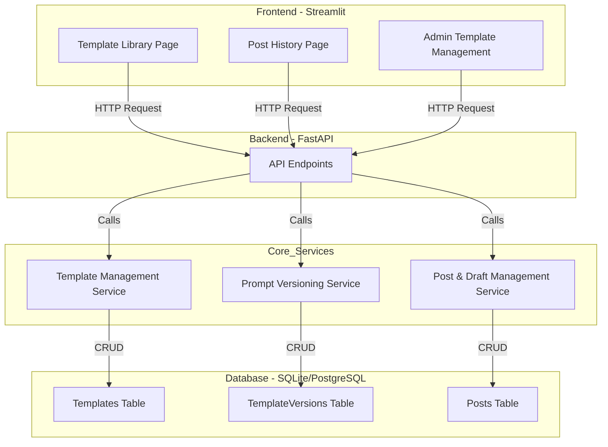
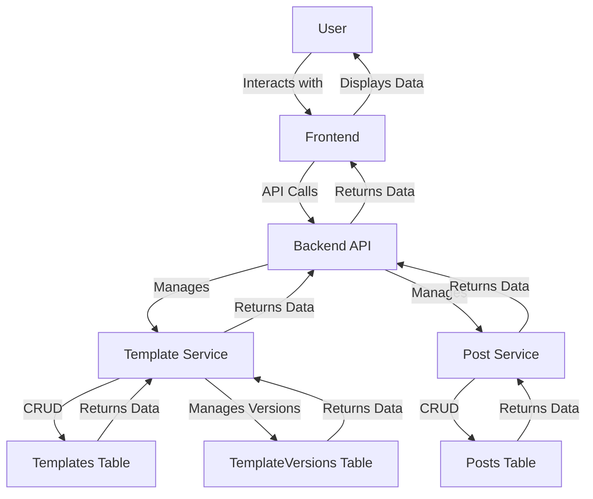
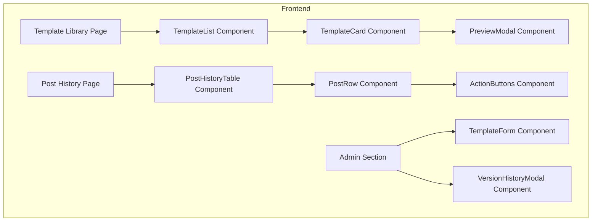
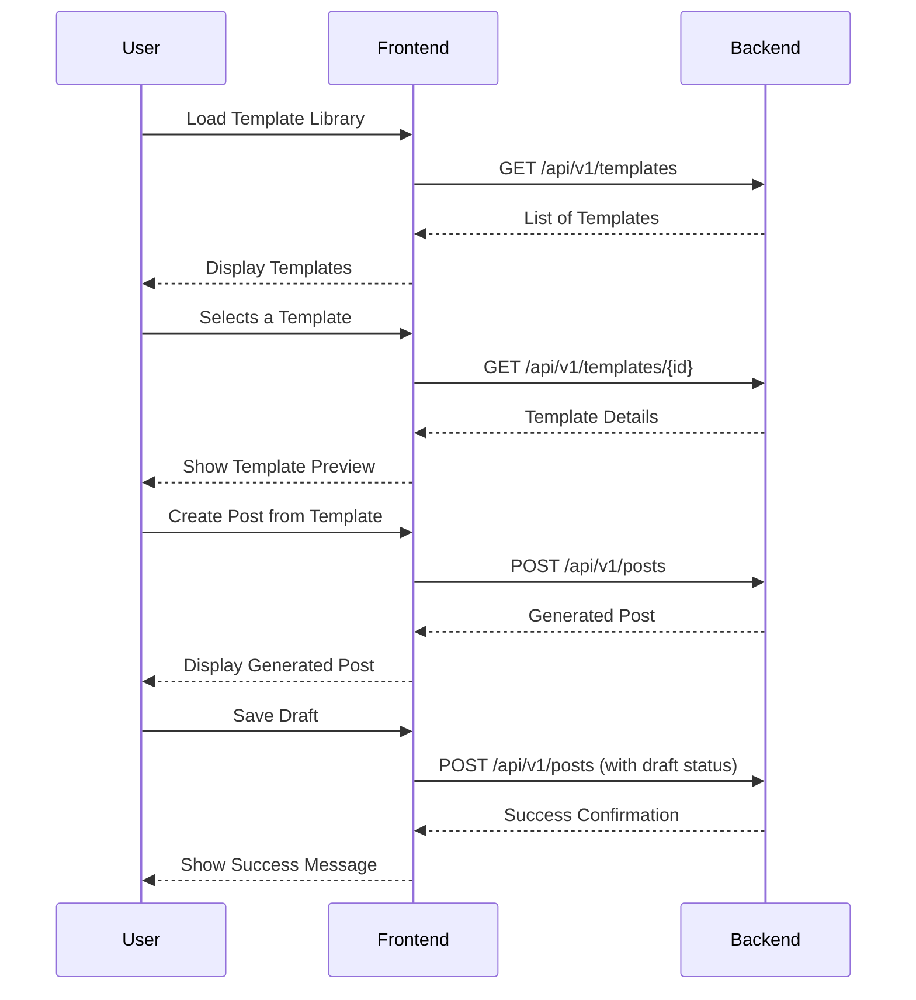

# Comprehensive Feature Architecture: Template & Context Management

This document provides a detailed architectural blueprint for the Template & Context Management feature in the AI Powered LinkedIn Ghostwriter application.

## 1. Feature Overview

- **Feature Name**: Template & Context Management
- **Feature Description**: This feature enables the management of post templates, context data, and draft history within the LinkedIn Ghostwriter application. It allows admins to create and maintain reusable post templates categorized by type and tone, while users can access these templates, view their structure, and reuse past generated posts or drafts. The feature also includes prompt versioning to track template performance and maintain iteration history. It helps users generate posts faster and ensures consistency in writing style and message tone.
- **User Stories**:
  - As an admin, I want to add, edit, and delete templates categorized by type, so that users have relevant options for generating posts.
  - As a user, I want to browse, preview, and select templates, so that I can easily choose the right structure for my post.
  - As a user, I want to save and view my previously generated posts and drafts, so that I can reuse or repurpose them later.
  - As an admin, I want to manage prompt versions, so I can analyze template performance and revert to previous configurations if needed.
- **Acceptance Criteria**:
  - Templates can be created, updated, and deleted via admin interface or CLI.
  - Templates are categorized by type and include metadata (name, tone, structure, example).
  - Users can browse available templates and preview structure before selecting one.
  - Generated posts and drafts are stored with metadata (template used, timestamp, tone).
  - Prompt versioning maintains changelog with version ID, date, and author.
  - Validation errors (missing fields, duplicates) are displayed clearly.
- **Dependencies**:
  - User Authentication: The feature requires a logged-in user to associate posts and drafts.
  - Post Generation Service: This feature integrates with the post generation service to create posts from templates.


## 2. Architecture Diagrams

### System Architecture Diagram


### Data Flow Diagram


### Component Hierarchy Diagram


### API Flow Diagram



## 3. Database Architecture

### Schema Changes
The existing `templates` table will be modified, and a new `template_versions` table will be added to support versioning.

```sql
-- templates table modification
ALTER TABLE templates ADD COLUMN tone TEXT;
ALTER TABLE templates ADD COLUMN example TEXT;

-- template_versions table
CREATE TABLE IF NOT EXISTS template_versions (
    id INTEGER PRIMARY KEY AUTOINCREMENT,
    template_id INTEGER NOT NULL,
    version INTEGER NOT NULL,
    prompt TEXT NOT NULL,
    structure TEXT NOT NULL,
    created_at TIMESTAMP DEFAULT CURRENT_TIMESTAMP,
    created_by TEXT NOT NULL,
    FOREIGN KEY (template_id) REFERENCES templates (id)
);
```

### Data Models

```typescript
// Template Data Model
interface Template {
  id: number;
  name: string;
  category: string;
  tone: string;
  structure: string[];
  example: string;
  createdAt: Date;
}

// TemplateVersion Data Model
interface TemplateVersion {
  id: number;
  templateId: number;
  version: number;
  prompt: string;
  structure: string[];
  createdAt: Date;
  createdBy: string;
}

// Post Data Model (for context)
interface Post {
  id: number;
  userId: number;
  content: string;
  templateId?: number;
  generationMode: 'manual' | 'auto';
  createdAt: Date;
}
```

### Relationships
- A `template` can have multiple `template_versions`.
- A `post` can be associated with a `template`.

### Indexes
- An index should be created on the `template_id` column in the `template_versions` table for faster lookups.
- An index should be created on the `user_id` column in the `posts` table.

### Migrations
1. Add `tone` and `example` columns to the `templates` table.
2. Create the `template_versions` table.
3. For each existing template, create an initial version in the `template_versions` table.


## 4. API Architecture

### Endpoint Definitions

#### Templates

- **`GET /api/v1/templates`**: List all templates.
  - **Method**: `GET`
  - **Auth**: Required
  - **Response Schema**: `Template[]`
  - **Status Codes**:
    - `200 OK`: Successfully retrieved templates.
    - `401 Unauthorized`: Authentication failed.

- **`POST /api/v1/templates`**: Create a new template.
  - **Method**: `POST`
  - **Auth**: Required (Admin only)
  - **Request Schema**: `CreateTemplateDto`
    ```typescript
    interface CreateTemplateDto {
      name: string;
      category: string;
      tone: string;
      structure: string[];
      example: string;
      prompt: string;
    }
    ```
  - **Response Schema**: `Template`
  - **Status Codes**:
    - `201 Created`: Template created successfully.
    - `400 Bad Request`: Invalid input.
    - `401 Unauthorized`: Authentication failed.
    - `403 Forbidden`: User is not an admin.

- **`PUT /api/v1/templates/{id}`**: Update an existing template.
  - **Method**: `PUT`
  - **Auth**: Required (Admin only)
  - **Request Schema**: `UpdateTemplateDto`
    ```typescript
    interface UpdateTemplateDto {
      name?: string;
      category?: string;
      tone?: string;
      structure?: string[];
      example?: string;
      prompt?: string;
    }
    ```
  - **Response Schema**: `Template`
  - **Status Codes**:
    - `200 OK`: Template updated successfully.
    - `400 Bad Request`: Invalid input.
    - `401 Unauthorized`: Authentication failed.
    - `403 Forbidden`: User is not an admin.
    - `404 Not Found`: Template not found.

- **`DELETE /api/v1/templates/{id}`**: Delete a template.
  - **Method**: `DELETE`
  - **Auth**: Required (Admin only)
  - **Response**: `204 No Content`
  - **Status Codes**:
    - `204 No Content`: Template deleted successfully.
    - `401 Unauthorized`: Authentication failed.
    - `403 Forbidden`: User is not an admin.
    - `404 Not Found`: Template not found.

#### Template Versions

- **`GET /api/v1/templates/{id}/versions`**: Get version history for a template.
  - **Method**: `GET`
  - **Auth**: Required (Admin only)
  - **Response Schema**: `TemplateVersion[]`
  - **Status Codes**:
    - `200 OK`: Successfully retrieved versions.
    - `401 Unauthorized`: Authentication failed.
    - `403 Forbidden`: User is not an admin.
    - `404 Not Found`: Template not found.

#### Posts & Drafts

- **`GET /api/v1/posts`**: Get all posts for the authenticated user.
  - **Method**: `GET`
  - **Auth**: Required
  - **Query Params**: `status=draft|published`
  - **Response Schema**: `Post[]`
  - **Status Codes**:
    - `200 OK`: Successfully retrieved posts.
    - `401 Unauthorized`: Authentication failed.

### Authentication Requirements
- All endpoints require a valid JWT token.
- Admin-only endpoints (`POST`, `PUT`, `DELETE` for templates, and `GET` for versions) require a user with the `admin` role.

### Rate Limiting
- A rate limit of 100 requests per minute should be applied to all endpoints to prevent abuse.

### Validation Rules
- All input data must be validated using Pydantic models on the backend.
- `name`, `category`, `tone`, `structure`, `example`, and `prompt` are required fields when creating a template.
- `structure` must be an array of strings.

### Error Handling
- Standard HTTP status codes will be used to indicate the outcome of a request.
- Error responses will have a consistent format:
  ```json
  {
    "error_code": "string",
    "message": "string",
    "details": "object | string"
  }
  ```


## 5. Frontend Architecture

### Component Specifications

#### `TemplateCard`
- **Purpose**: Displays a single template in the library.
- **Props**:
  ```typescript
  interface TemplateCardProps {
    template: Template;
    onSelect: (template: Template) => void;
  }
  ```
- **State**: None
- **Event Handlers**:
  - `onClick`: Calls the `onSelect` prop.
- **Styling**: Card layout with template name, category, and tone.

#### `TemplateList`
- **Purpose**: Renders a list of `TemplateCard` components.
- **Props**:
  ```typescript
  interface TemplateListProps {
    templates: Template[];
    onSelectTemplate: (template: Template) => void;
  }
  ```
- **State**: None
- **Event Handlers**: None

#### `PreviewModal`
- **Purpose**: Shows a detailed preview of a selected template.
- **Props**:
  ```typescript
  interface PreviewModalProps {
    template: Template;
    onClose: () => void;
    onUseTemplate: (template: Template) => void;
  }
  ```
- **State**: `isOpen`
- **Event Handlers**:
  - `onClose`: Closes the modal.
  - `onUseTemplate`: Proceeds to use the template for post creation.

### Page Components

#### `Template Library Page`
- **Route**: `/templates`
- **Components**: `TemplateList`, `PreviewModal`
- **State Management**:
  - `templates`: Fetched from `GET /api/v1/templates`.
  - `selectedTemplate`: The template currently being previewed.
- **Logic**:
  - Fetches templates on page load.
  - Opens the `PreviewModal` when a template is selected.

#### `Post History Page`
- **Route**: `/posts`
- **Components**: `PostHistoryTable`
- **State Management**:
  - `posts`: Fetched from `GET /api/v1/posts`.
- **Logic**:
  - Fetches user's post history on page load.
  - Allows filtering by status (draft/published).

#### `Admin Template Management Page`
- **Route**: `/admin/templates`
- **Components**: `TemplateForm`, `VersionHistoryModal`
- **State Management**:
  - `templates`: Fetched from `GET /api/v1/templates`.
  - `editingTemplate`: The template currently being edited.
- **Logic**:
  - Allows creating, updating, and deleting templates.
  - Shows version history for a selected template.

### Routing
- `/templates`: Template Library
- `/posts`: Post History
- `/admin/templates`: Admin Template Management

### State Management
- State will be managed locally within each page component using Streamlit's session state.
- Data fetching will be handled by the `api_client.py` utility.

### Form Handling
- The `TemplateForm` component will handle form state and validation for creating/editing templates.
- Validation rules will mirror the backend validation.


## 6. Security Architecture

### Authentication Requirements
- All API endpoints related to this feature must be protected and require a valid JWT.
- Admin-specific operations (creating, updating, deleting templates, and viewing version history) must be restricted to users with an 'admin' role.

### Authorization Rules
- A user can only view and manage their own posts and drafts.
- An admin user has full CRUD access to all templates and can view all version histories.

### Data Validation
- All user input from the frontend must be sanitized and validated on the backend to prevent XSS and other injection attacks.
- Pydantic models will be used for strict data validation.

### Security Headers
- The FastAPI backend should include standard security headers in all responses, such as `Content-Security-Policy`, `X-Content-Type-Options`, and `X-Frame-Options`.

### Audit Logging
- All template CRUD operations (create, update, delete) must be logged with the admin user's ID and a timestamp.
- All post and draft creation and deletion events must be logged with the user's ID and a timestamp.


## 7. Integration Points

### Existing App Integration
- **Post Generation Service**: The `post_generator.py` service will be modified to accept a `template_id` and use the corresponding template prompt for post generation.
- **User Authentication**: The feature will rely on the existing JWT-based authentication system to identify and authorize users.

### Third-party Services
- No new third-party services are required for this feature.

### Event Handling
- No new events are emitted or consumed by this feature.

### Shared Components
- The `api_client.py` utility in the frontend will be updated to include methods for interacting with the new template and post endpoints.


## 8. Implementation Specifications

### File Structure

```
backend/
│   ├── app/
│   │   ├── api/
│   │   │   └── v1/
│   │   │       ├── endpoints/
│   │   │       │   ├── templates.py  // New file
│   │   │       │   └── posts.py      // Modified
...
│   │   ├── schemas/
│   │   │   ├── template.py         // New file
│   │   │   └── post.py             // Modified
...
frontend/
│   ├── pages/
│   │   ├── 1_Create_Post.py
│   │   ├── 2_Auto_Post.py
│   │   ├── 3_My_Posts.py
│   │   └── 5_Admin_Templates.py  // New file
...
```

### Naming Conventions
- **API Endpoints**: Use plural nouns (e.g., `/templates`, `/posts`).
- **Database Tables**: Use plural nouns (e.g., `templates`, `posts`, `template_versions`).
- **Pydantic Schemas**: Use singular nouns with `Schema` suffix (e.g., `TemplateSchema`, `PostSchema`).
- **Frontend Components**: Use PascalCase (e.g., `TemplateCard`, `PreviewModal`).

### Code Organization
- **Backend**:
  - `templates.py`: Will contain all API endpoints related to templates and their versions.
  - `posts.py`: Will be modified to handle draft saving and retrieval.
  - `schemas/template.py`: Will contain all Pydantic schemas for templates and versions.
- **Frontend**:
  - `5_Admin_Templates.py`: A new page for admin users to manage templates.
  - `api_client.py`: Will be updated with functions to call the new template and post endpoints.

### Type Definitions
All new data structures (templates, template versions) must have corresponding TypeScript interfaces defined in the frontend and Pydantic models in the backend.

### Constants
- No new constants are anticipated for this feature.


## 9. Testing Requirements

### Unit Tests
- **Backend**:
  - Test all template CRUD operations in the `Template Management Service`.
  - Test the prompt versioning logic in the `Prompt Versioning Service`.
  - Test the post and draft management logic in the `Post & Draft Management Service`.
  - Mock database and external dependencies.
- **Frontend**:
  - Test the `TemplateCard` component's rendering and event handling.
  - Test the `PreviewModal` component's state changes and event handling.

### Integration Tests
- Test the full lifecycle of a template: creation, updating, versioning, and deletion through the API.
- Test the creation of a post from a template.
- Test the saving and retrieval of drafts.
- Use a dedicated test database for these tests.

### E2E Tests
- Simulate a user browsing templates, selecting one, and generating a post.
- Simulate an admin user creating, updating, and deleting a template.
- Verify that the UI updates correctly after each action.

### Test Data
- Create a set of predefined templates to be used in tests.
- Create mock user data for testing authentication and authorization.


## 10. Performance Considerations

### Optimization Requirements
- The `GET /api/v1/templates` endpoint should be optimized to handle a large number of templates efficiently.
- The frontend should use pagination or infinite scrolling if the number of templates or posts becomes large.

### Caching Strategy
- The list of templates can be cached on the frontend to reduce the number of API calls.
- The backend can use a cache (like Redis) to store frequently accessed templates.

### Database Queries
- Ensure that all database queries are efficient and use indexes where appropriate.
- Avoid N+1 query problems when fetching templates and their versions.

### Bundle Size
- Keep the frontend bundle size as small as possible by code-splitting and lazy-loading components where appropriate.
